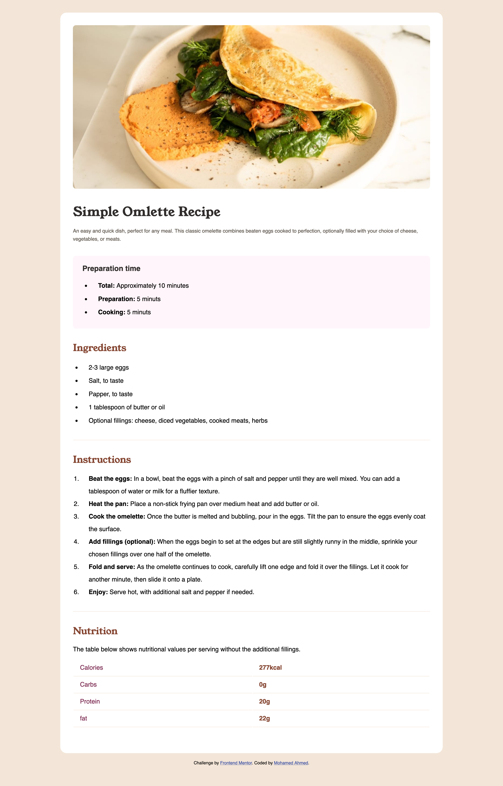

# Frontend Mentor - Recipe page solution

This is a solution to the [Recipe page challenge on Frontend Mentor](https://www.frontendmentor.io/challenges/recipe-page-KiTsR8QQKm). Frontend Mentor challenges help you improve your coding skills by building realistic projects.

## Table of contents

- [Overview](#overview)
  - [The challenge](#the-challenge)
  - [Screenshot](#screenshot)
  - [Links](#links)
- [My process](#my-process)
  - [Built with](#built-with)
- [Author](#author)
- [Acknowledgments](#acknowledgments)

**Note: Delete this note and update the table of contents based on what sections you keep.**

## Overview

### the-challenge

    (Recipe page challenge on Frontend Mentor)

### Screenshot

    

### Links

- Solution URL: [Frontend Mentor - Recipe page solution](https://mnsa2020.github.io/Frontend-Mentor---Recipe-page-solution/)

## My process

### Built with

- HTML5
- SASS

## Author

- Website - [Mohamed Ahmed](https://)
- Frontend Mentor - [@mnsa2020](https://www.frontendmentor.io/profile/mnsa2020)
